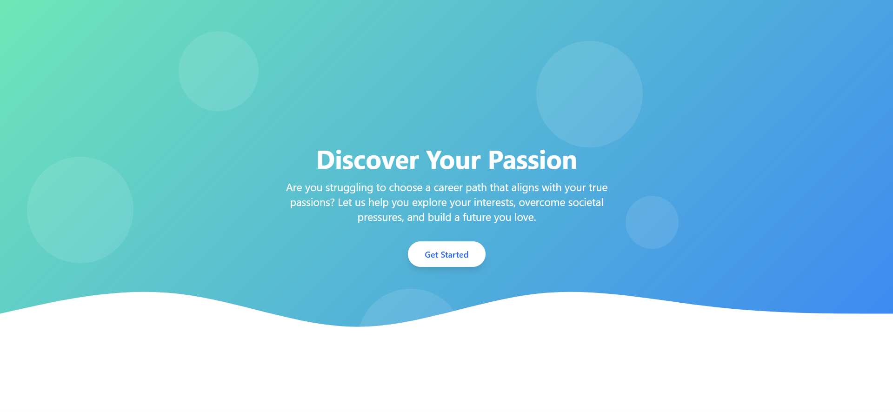
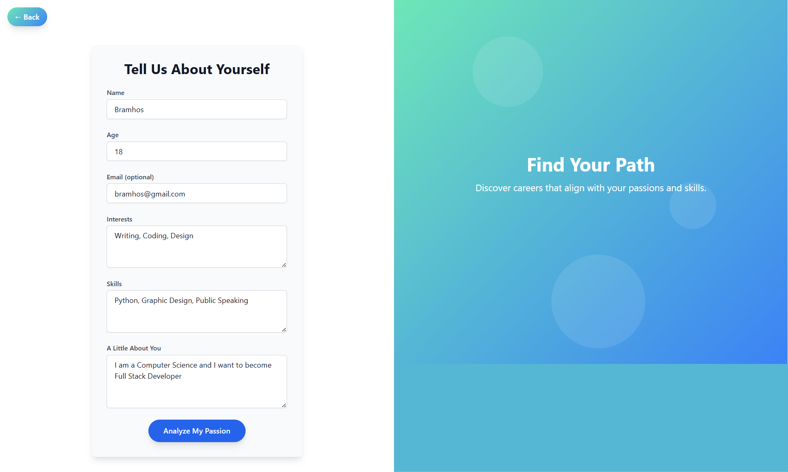
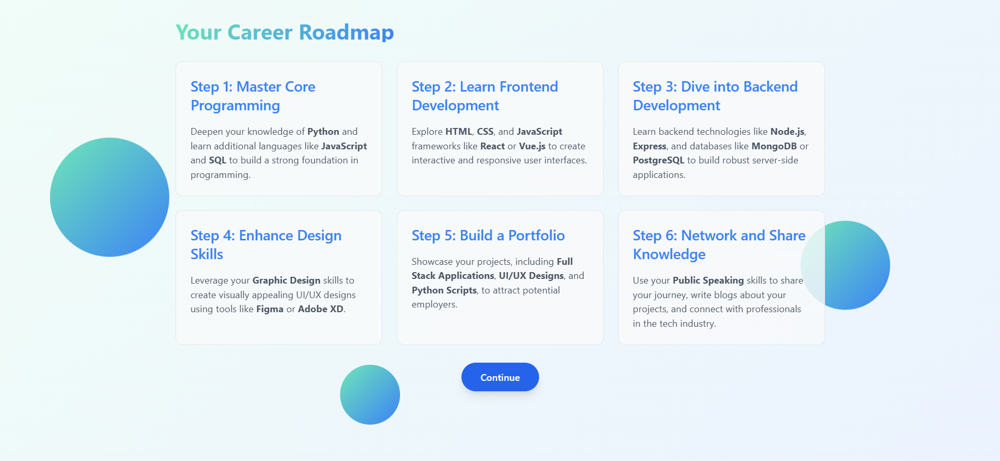
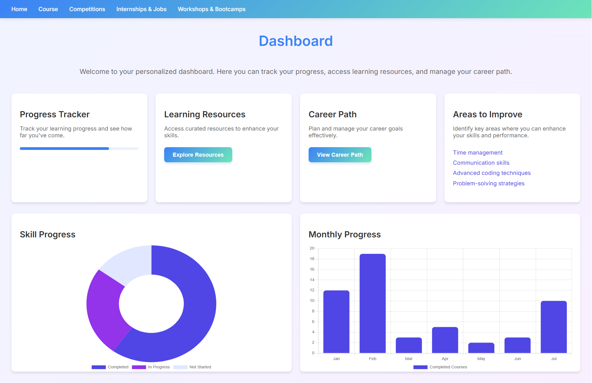
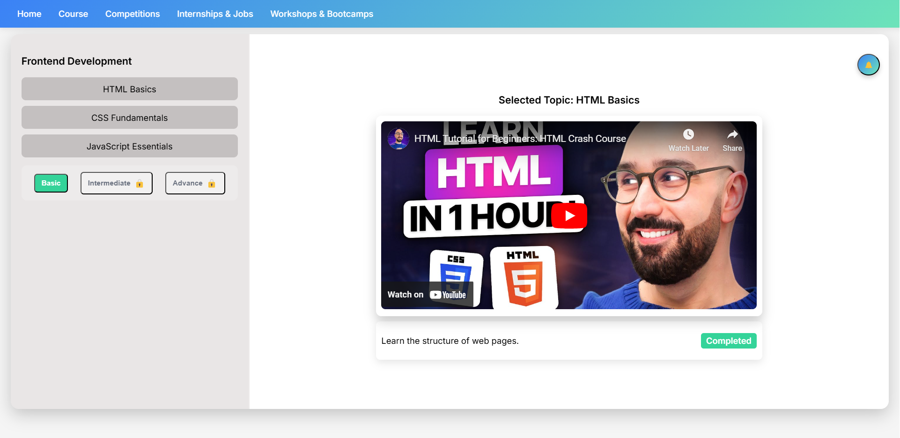
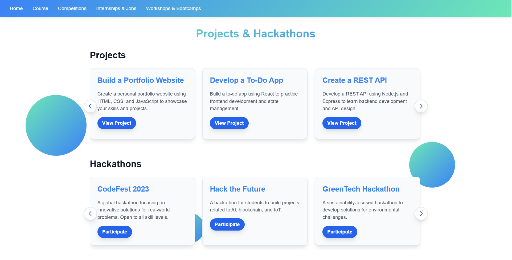
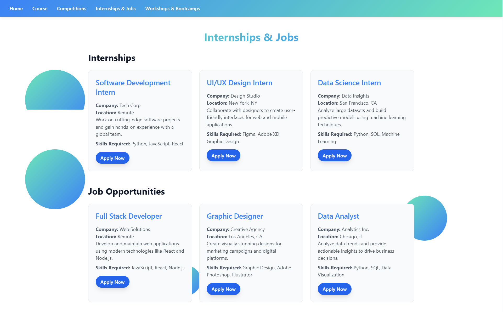
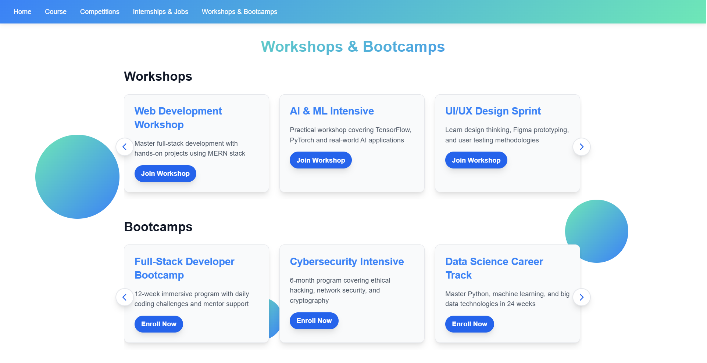

# 🌟 SkillEduu - Where Passion Meets Learning 🚀

**Empowering Students to Align Passion with Career**  

 <!-- Add your banner image here -->

## 📖 Overview
**SkillEduu** is a revolutionary web application designed to help students, especially those from **underserved regions**, break free from societal pressures and discover careers aligned with their **true interests**. 💡 We guide students from self-discovery to job placement through AI-driven mentorship, personalized learning, and real-world experience.

**Problem**: Millions of students choose careers based on external pressures, leading to dissatisfaction and unfulfilled potential. 😔  
**Solution**: A holistic platform that identifies passions, maps careers, and provides end-to-end upskilling. 🎯

---

## ✨ Key Features
| Feature | Description |
|---------|-------------|
| **Interest Analysis** 🧠 | Students write freely about their passions (via stories, hints, or direct input). AI analyzes text to identify core interests. |
| **Interactive Career Flowchart** 📊 | Visualize career paths, salaries, and role details. Hover/click for insights! |
| **AI-Powered Course Generator** 🤖 | Custom courses with AI-generated videos, syllabus, and milestones (Beginner → Intermediate → Advanced). |
| **Competition & Project Hub** 🏅 | Auto-push competitions (Unstop, etc.) and project ideas to build portfolios. |
| **Internship & Job Tracker** 💼 | Real-time internship/job alerts from company career pages. |
| **Mentor Connect** 🧑🏫 | 24/7 mentor support via call/chat for career clarity. |
| **Progress Dashboard** 📈 | Track course progress, competition wins, and skill growth. |
| **Workshops & LinkedIn Sessions** 🎤 | Resume building, networking webinars, and guest talks with industry leaders. |

---

## 🛠️ How It Works?
1. **Awakening Phase** 🌱  
   - Motivational talks/stories to inspire self-reflection.
   - Students fill the **"Interest Box"** (text, stories, or voice notes).
2. **Career Mapping** 🗺️  
   - AI generates a flowchart of suggested fields/jobs.
   - Mentor support for confused students.
3. **AI Course Creation** 🎥  
   - Custom syllabus + AI-generated video lessons.
4. **Gamified Learning** 🎮  
   - Competitions → Projects → Internships → Jobs.
5. **Placement Drive** 🚀  
   - Direct apply to roles with portfolio tracking.

---

## 🔧 Technology Stack
- **Frontend**: React.js + Tailwind CSS  
- **Backend**: Node.js + Express.js  
- **AI/ML**: NLP (GPT-4 for interest analysis), OpenAI Video Generation  
- **Database**: MongoDB  
- **APIs**: Web scraping (internship/job alerts), Payment Gateway  
- **DevOps**: AWS EC2, Docker, GitHub Actions  

---

## 🖼️ Screenshots
**Here’s a glimpse of SkillEduu in action:**  
<!-- Add 8 screenshots in a grid layout -->

  
  
  
  
   
  
  
  
  

---
